# TESTING STRATEGY & SUITES

This document describes the test environment, suite structure, and commands required to verify the correct operation of the **MIPS Instruction Decoder & Encoder**.

The project uses **Vitest** as a next-generation test runner due to its speed, native TypeScript support, and ES Modules compatibility.

---

## How To Run The Tests (Quick Commands)

You can copy and paste these commands directly into your terminal:

### Run all tests once (CI/CD / Quick Verification)
```bash
pnpm test run
```
*Or with npm:*
```bash
npm run test -- --run
```

### Run tests in interactive watch mode
```bash
pnpm test
```
*Or with npm:*
```bash
npm run test
```

### Run tests with a detailed code coverage report
```bash
pnpm exec vitest run --coverage
```
*Or with npm:*
```bash
npx vitest run --coverage
```

---

## Test Suites Breakdown

The project contains **12 specific test files** in the `test/` directory, covering everything from basic syntax parsing to complex regressions and performance benchmarks.

---

### 1. INTEGRATION TESTS
* **File:** [test/integration.test.ts](file:///c:/Users/sebas/OneDrive/Escritorio/Arkad/Instruction_Decoder/test/integration.test.ts)
* **Goal:** Validate the integration of the complete flow (`assembly code` ➔ `32-bit hexadecimal` ➔ `decoded instruction` ➔ `formatted text`).
* **Key Details:**
  * Compares exact instruction encodings, such as `lw $s0, 4($sp)` (resulting in `0x8FB00004`).
  * Executes complete programs including backward loops (branches with negative offset) and a **full recursive Fibonacci program** (30 instructions, validating offset calculations for labels, `jal`, and `jr` behavior).

#### Command to run:
```bash
pnpm test test/integration.test.ts --run
```

#### Test Evidence Screenshot
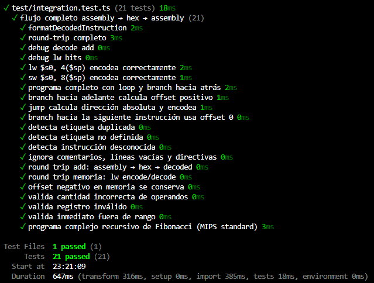

---

### 2. END-TO-END TESTS (E2E)
* **File:** [test/e2e.test.ts](file:///c:/Users/sebas/OneDrive/Escritorio/Arkad/Instruction_Decoder/test/e2e.test.ts)
* **Goal:** Prove that the full pipeline does not fail, executes instructions within optimal performance bounds, and catches syntax errors.
* **Key Details:**
  * Performs full round-trip tests for R-type, I-type, jumps, branches, and memory instructions.
  * Validates execution time limits for 100 consecutive pipeline runs.
  * Verifies syntax exception handling: duplicate labels, invalid registers (e.g., `$xyz`), and out-of-bounds 16-bit immediates.

#### Command to run:
```bash
pnpm test test/e2e.test.ts --run
```

#### Test Evidence Screenshot
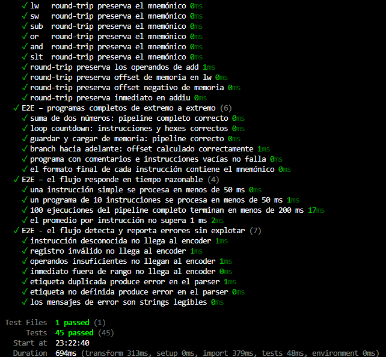

---

### 3. BIT MANIPULATION UNIT TESTS (BIT UTILS)
* **File:** [test/bit.utils.test.ts](file:///c:/Users/sebas/OneDrive/Escritorio/Arkad/Instruction_Decoder/test/bit.utils.test.ts)
* **Goal:** Verify the precision of binary string manipulation helper utilities for the encoder/decoder.
* **Key Details:**
  * Tests conversions for `hexToBits` and `bitsToHex`.
  * Conversions for signed integers using two's complement (`constToBits`) and back to numbers (`bitsToSignedNum` / `bitsToUnsignedNum`).
  * Extracting exact bit ranges for opcodes, registers (`rs`, `rt`, `rd`), `shamt`, `funct`, and immediates.

#### Command to run:
```bash
pnpm test test/bit.utils.test.ts --run
```

#### Test Evidence Screenshot
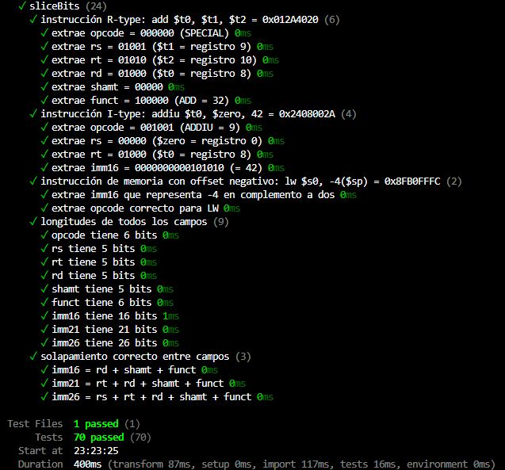

---

### 4. LIMIT AND FRONTIER TESTS (BOUNDARY TESTS)
* **File:** [test/boundary.test.ts](file:///c:/Users/sebas/OneDrive/Escritorio/Arkad/Instruction_Decoder/test/boundary.test.ts)
* **Goal:** Analyze the pipeline's behavior when processing minimum, maximum, and boundary values.
* **Key Details:**
  * 16-bit signed immediates: validates exact boundaries for `-32768` and `32767`.
  * Verifies shift amount (`shamt`) bounds in the `[0, 31]` range.
  * Validates behavior for special registers (like `$zero`) and hexadecimal immediates.

#### Command to run:
```bash
pnpm test test/boundary.test.ts --run
```

#### Test Evidence Screenshot
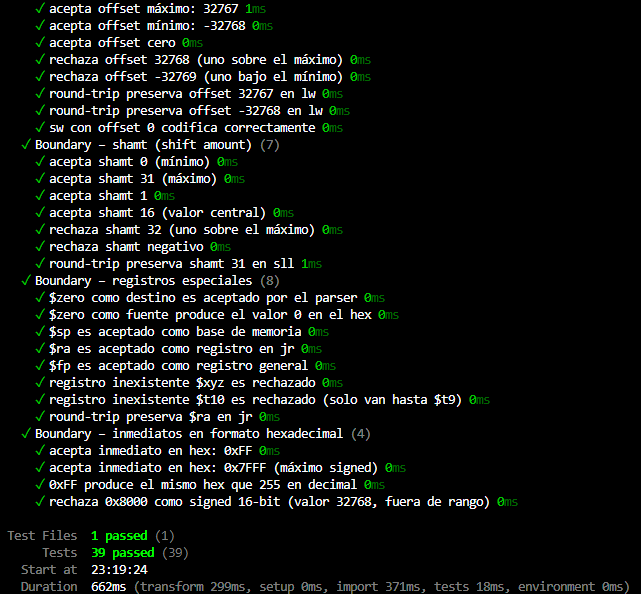

---

### 5. CONSTANTS INTEGRITY TESTS
* **File:** [test/constants.integrity.test.ts](file:///c:/Users/sebas/OneDrive/Escritorio/Arkad/Instruction_Decoder/test/constants.integrity.test.ts)
* **Goal:** Prevent opcode collisions, duplicate functions, or mismapped registers from breaking instruction encoding/decoding.
* **Key Details:**
  * Validates that there are no duplicate names or bit mappings in the registers dictionary.
  * Verifies uniqueness of the `opcode` + `funct` pairs in both Legacy and R6 encoding tables.

#### Command to run:
```bash
pnpm test test/constants.integrity.test.ts --run
```

#### Test Evidence Screenshot
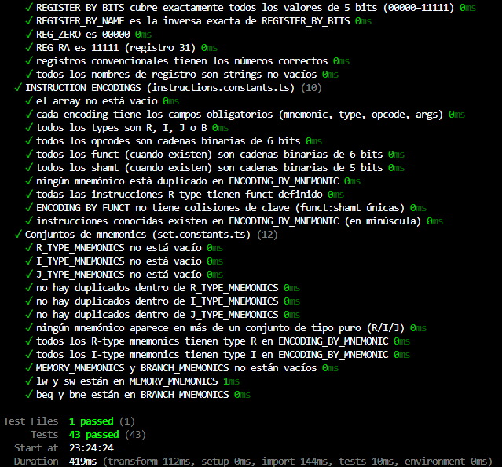

---

### 6. INSTRUCTION COVERAGE TESTS
* **File:** [test/coverage.test.ts](file:///c:/Users/sebas/OneDrive/Escritorio/Arkad/Instruction_Decoder/test/coverage.test.ts)
* **Goal:** Ensure every supported MIPS instruction has at least one functional test case verifying a full round-trip.
* **Key Details:**
  * Covers arithmetic (`add`, `sub`, `addu`), logical (`and`, `or`, `xor`), shift, branch, and memory (`lw`, `sw`) instructions.

#### Command to run:
```bash
pnpm test test/coverage.test.ts --run
```

#### Test Evidence Screenshot
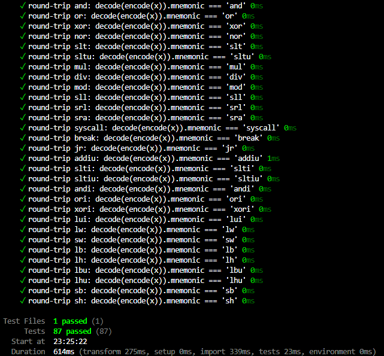

---

### 7. ASSEMBLY PARSER TESTS
* **File:** [test/parser.test.ts](file:///c:/Users/sebas/OneDrive/Escritorio/Arkad/Instruction_Decoder/test/parser.test.ts)
* **Goal:** Ensure the syntactic formatter correctly interprets the textual structure of MIPS assembly code.
* **Key Details:**
  * Handles comments (`#`), extra whitespaces, line breaks, and tabs.
  * Extracts labels and computes relative jump offsets.

#### Command to run:
```bash
pnpm test test/parser.test.ts --run
```

#### Test Evidence Screenshot
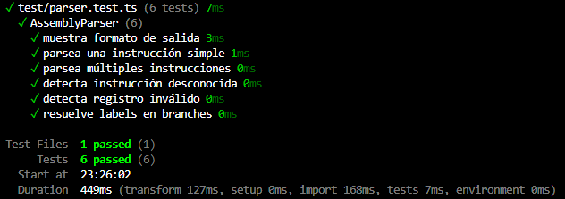

---

### 8. HANDLER REGISTRY TESTS
* **File:** [test/registry.test.ts](file:///c:/Users/sebas/OneDrive/Escritorio/Arkad/Instruction_Decoder/test/registry.test.ts)
* **Goal:** Verify the dynamic registry mapping assembly instructions to their binary handlers.
* **Key Details:**
  * Tests searching for MIPS instructions by object format.
  * Tests reverse-lookup matching bits extracted from 32-bit hexadecimal strings.

#### Command to run:
```bash
pnpm test test/registry.test.ts --run
```

#### Test Evidence Screenshot
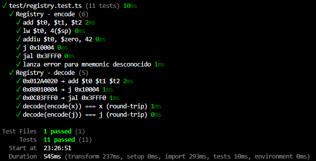

---

### 9. STRESS TESTS
* **File:** [test/stress.test.ts](file:///c:/Users/sebas/OneDrive/Escritorio/Arkad/Instruction_Decoder/test/stress.test.ts)
* **Goal:** Validate robustness by running consecutive round-trip conversions for 100% of defined instructions.
* **Key Details:**
  * Encodes and decodes every registered instruction in sequence to guarantee full stability.

#### Command to run:
```bash
pnpm test test/stress.test.ts --run
```

#### Test Evidence Screenshot
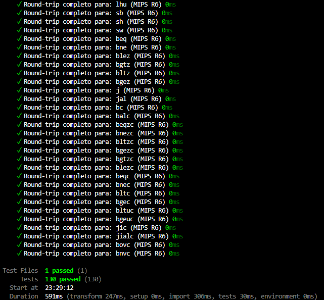

---

### 10. PERFORMANCE & SCALABILITY TESTS
* **File:** [test/performance.test.ts](file:///c:/Users/sebas/OneDrive/Escritorio/Arkad/Instruction_Decoder/test/performance.test.ts)
* **Goal:** Ensure the library remains fast and does not introduce bottlenecks as the volume of source instructions increases.
* **Key Details:**
  * Benchmarks performance by compiling thousands of instructions per second.
  * Validates that the average response time per instruction remains under fraction-of-a-millisecond thresholds.

#### Command to run:
```bash
pnpm test test/performance.test.ts --run
```

#### Test Evidence Screenshot
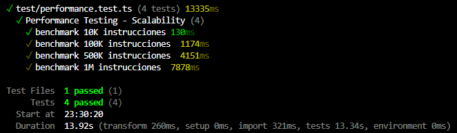

---

### 11. DIAGNOSTIC TESTS
* **File:** [test/diagnostic.test.ts](file:///c:/Users/sebas/OneDrive/Escritorio/Arkad/Instruction_Decoder/test/diagnostic.test.ts)
* **Goal:** Print the loader configuration inside the encoder for visual auditing.
* **Key Details:**
  * Outputs a structured console table (`console.table`) of all active opcodes, funct fields, shamt fields, and target instruction versions.

#### Command to run:
```bash
pnpm test test/diagnostic.test.ts --run
```

#### Test Evidence Screenshot
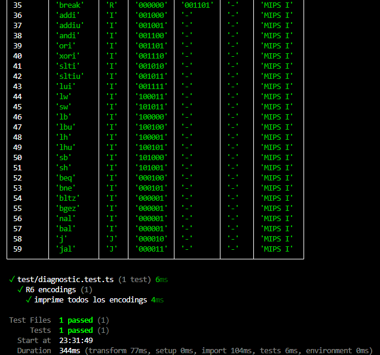

---

## What It Means When These Tests Pass

Green test status across the entire suite guarantees that:
1. **Binary consistency is preserved**: Every instruction translates to its standard MIPS hexadecimal counterpart bidirectionally.
2. **The assembly parser works**: Textual MIPS assembly is transformed into structured objects without losing operand details.
3. **The software is robust and fast**: The pipeline processes programs efficiently and returns helpful syntax error details to users instead of crashing.